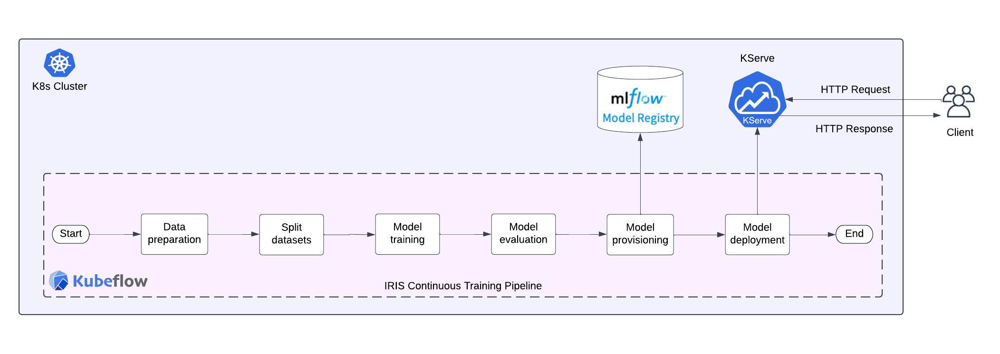

# ML-Pipeline-with-Kubeflow-MLflow-KServe

By bringing together these components on minikube, we can go from data to deployment with an integrated pipeline — training effective models with Kubeflow, registering them with MLflow for versioning and lineage, and then serving predictions robustly with KServe. This unified environment gives us an extensible platform to develop, deploy, and monitor our models with the tools purpose-built for machine learning and Kubernetes.

## MLOps Pipeline


## 🛠️Minikube Setup

Install the minikube cluster
```choco install minikube```

Start the minikube cluster
```minikube start```

How to manage minikube cluster?

Check the minikube cluster status — `minikube status`

Stop the cluster — `minikube stop`

Delete all of the minikube clusters — `minikube delete --all`

List all the pods within the minikube cluster — `minikube get pod -A`