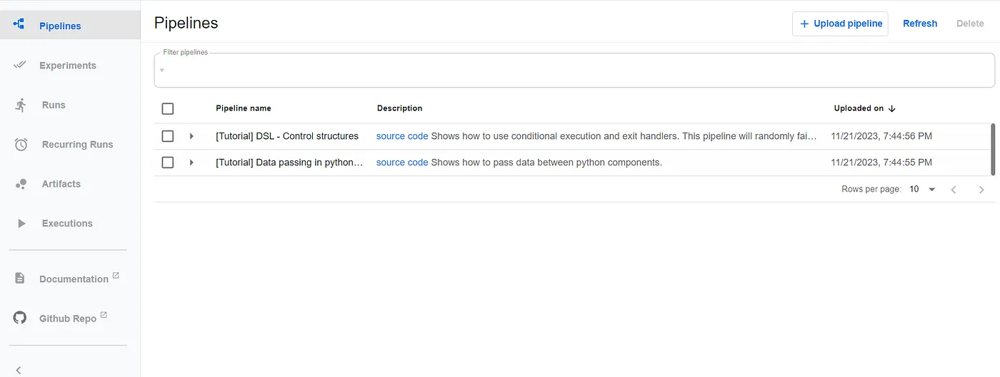
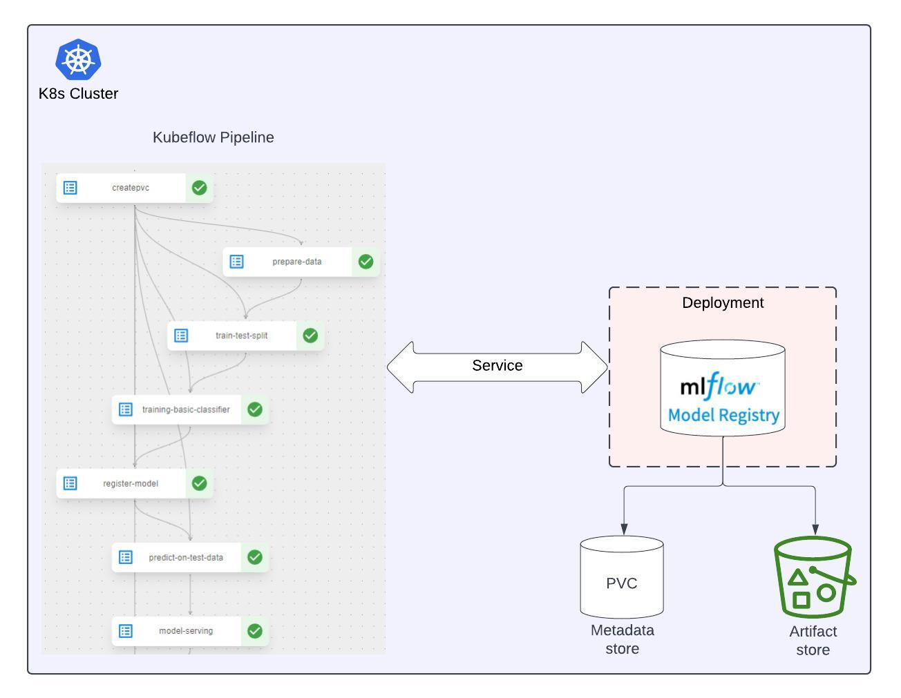

# ML-Pipeline-with-Kubeflow-MLflow-KServe

By bringing together these components on minikube, we can go from data to deployment with an integrated pipeline — training effective models with Kubeflow, registering them with MLflow for versioning and lineage, and then serving predictions robustly with KServe. This unified environment gives us an extensible platform to develop, deploy, and monitor our models with the tools purpose-built for machine learning and Kubernetes.

## MLOps Pipeline


## 🛠️Minikube Setup

Install the minikube cluster
`choco install minikube`

Start the minikube cluster
`minikube start`

**How to manage minikube cluster?**

Check the minikube cluster status — `minikube status`

Stop the cluster — `minikube stop`

Delete all of the minikube clusters — `minikube delete --all`

List all the pods within the minikube cluster — `minikube get pod -A`

## 🛠️Kubeflow Setup

Install Kubeflow locally is to use the manifest files from the Git repo

```
kubectl apply -k "github.com/kubeflow/pipelines/manifests/kustomize/cluster-scoped-resources?ref=2.0.0"

kubectl wait --for condition=established --timeout=60s crd/applications.app.k8s.io

kubectl apply -k "github.com/kubeflow/pipelines/manifests/kustomize/env/dev?ref=2.0.0"
```

Let’s verify that the Kubeflow Pipelines UI or dashboard is accessible by port-forwarding:

`kubectl port-forward -n kubeflow svc/ml-pipeline-ui 8080:80`



## 🛠️MLflow Setup

Let’s install MLflow tracking server on Minikube cluster and understand how Kubeflow pipelines can interact with MLflow tracking server.



We need to create the service account that will be used in model deployment using KServe and secret that will be used in Kubeflow pipeline steps to register the models and load the model artifacts from S3, and MLflow tracking server to populate the model artifact details from s3 on MLflow UI.

Let's create a service account and secret using K8s manifest file

```
cd config/secrets

kubectl apply -f create-s3-sa.yaml

```

Let’s create PVC to store the model metadata

```
cd config/mlflow

kubectl apply -f mlflow-pvc.yaml

```

Let’s define another K8s manifest file (mlflow.yaml) for MLflow setup on Minikube.

```
cd config/mlflow

kubectl apply -f mlflow.yaml

```

If you look at `mlflow.yaml`, you’re likely familiar with the `host` and `port` arguments, the latter two might be new. They specify where MLflow should log our model metadata for the model registry and where to log the model artifacts. In this setup, I’m utilizing a simple Persistent Volume Claim (PVC).

`--backend-store-uri=/opt/mlflow/backend` is used to store the metadata (model parameters, evaluation metrics, etc) in PVC.

`--default-artifact-root=s3://kubeflow-mlflow/experiments` is used to store the artifacts (model artifacts) in S3.

Let’s verify that the MLflow dashboard is accessible by port-forwarding:

`kubectl port-forward -n kubeflow svc/mlflowserver 8081:5000`

Then, open the MLflow dashboard at `http://localhost:8081/`


## 🛠️KServe Setup

First, we need to get a copy of the KServe repository on `config` directory. Use git bash to clone the KServe repository.

```
cd config/kubeflow
git clone https://github.com/kserve/kserve.git
```

We can’t download the Istio 1.17.2 due to some issue, hence we can download the Istio 1.17.2 from the release page for Windows. Extract the `istio-1.17.2-win.zip` file and place the `istio-1.17.2` folder under kubeflow directory.

```
cd config/kubeflow
./hack/quick_install.sh
```